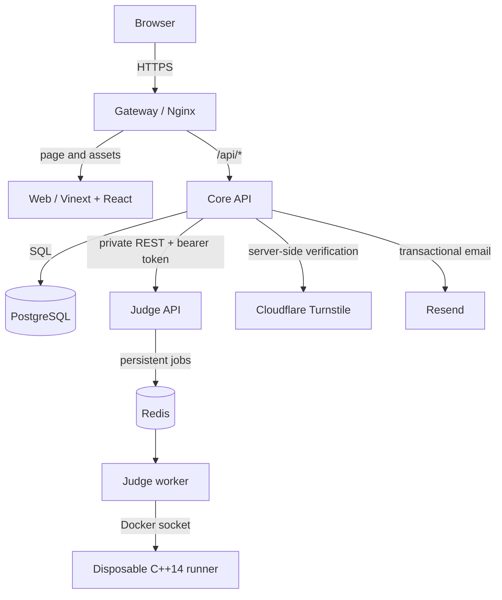
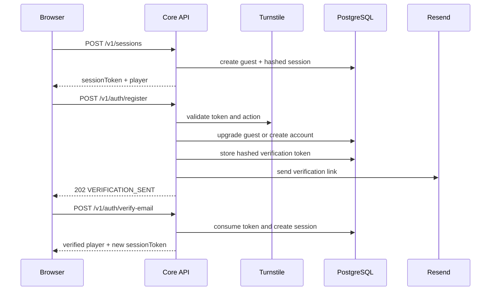
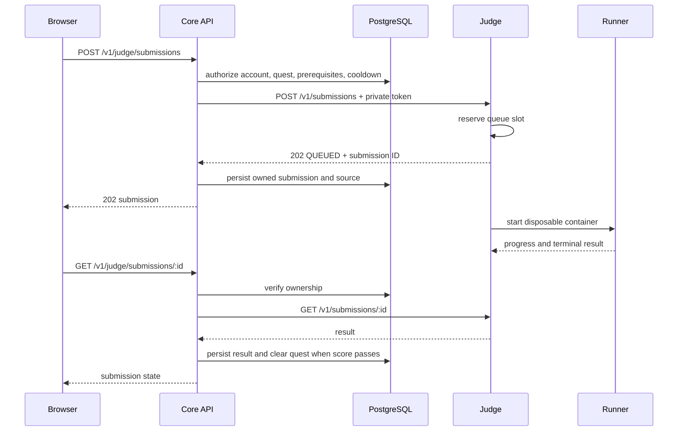

# AlgoQuest service architecture

This document describes the runtime and trust boundaries implemented by the
current AlgoQuest codebase. Endpoint-level request and response details live in
[API.md](API.md).

## Runtime topology



The public boundary ends at the Gateway. The Web application contains only
public configuration and browser code. The Core API owns identity, authorization,
content policy, saves, and database access. The Judge API owns validation and
queueing; a separate worker owns Docker execution.

## Design principles

1. **One public origin.** Nginx serves the Web application and proxies `/api/*`
   to the Core API, avoiding cross-origin browser configuration in the normal
   deployment.
2. **Single data owner.** PostgreSQL is not exposed as an application API. Only
   the Core API reads or writes player and platform data.
3. **Single execution owner.** Only the dedicated Judge worker can access the
   Docker socket. The socket-free Judge API accepts jobs over a private HTTP
   contract and persists them in Redis.
4. **Server-authoritative progression.** A quest can be marked cleared only when
   the account has a persisted submission whose accepted score meets the quest's
   pass threshold.
5. **Public and secret quest data are separated.** Browsers receive statements,
   limits, and map metadata. Hidden tests stay in PostgreSQL or the Judge image
   and are forwarded only across the private API boundary.
6. **Roles are enforced in the Core API.** UI visibility is convenience, not an
   authorization control.

## Services

### Gateway

The `gateway` service is an Nginx container that:

- listens on the deployment's public port;
- proxies page and asset requests to `web`;
- proxies `/api/*` to `api`;
- keeps the browser on one origin;
- reads upstream locations from `WEB_UPSTREAM` and `API_UPSTREAM`;
- runs with a read-only filesystem, tmpfs runtime directories, and
  `no-new-privileges`.

The gateway owns no application secrets. Split-host deployments can point its API
upstream at an internal hostname, Tailnet address, or protected tunnel.

### Web

The `web` service builds and serves the Vinext/React application. It contains:

- the ASCII-art world and responsive quest map;
- 22 built-in C++14 missions from first input through maximum flow;
- adaptive recommended starting points based on prior C++ and algorithm
  experience;
- a mandatory first-use interface tutorial and skippable, replayable quest
  prologues;
- support for merging database-backed quest overrides and custom quests;
- administrator-editable map positions with collision-aware placement;
- a lazy-loaded, self-hosted Monaco mission editor;
- sample and full submission workflows;
- local draft persistence and cloud save reconciliation;
- account, editorial, administration, and owner interfaces;
- the searchable algorithm Codex;
- English, Simplified Chinese, and Japanese copy.

`NEXT_PUBLIC_API_BASE_URL` is compiled into the browser bundle. Its default is
`/api/v1`, which Nginx maps to the Core API's `/v1` namespace.

The Web service never receives `DATABASE_URL`, `JUDGE_API_TOKEN`, Resend secrets,
or the Turnstile secret key.

### Core API

The Core API is a Node.js HTTP service on port `8787`. It is responsible for:

#### Identity and account security

- creating rate-limited guest sessions;
- upgrading a guest or creating a new email/password account;
- email verification and password reset through expiring opaque tokens;
- validating Turnstile token, action, remote address, and optional hostname;
- hashing passwords with salted `scrypt`;
- storing only SHA-256 hashes of bearer session tokens;
- revoking the current session on logout and all old sessions on password reset;
- bootstrapping and protecting the site owner role.

#### Player state

- loading the current player and role;
- updating display names;
- storing progress and best score;
- storing the latest source draft for each quest;
- retaining source-bearing submission history;
- resolving local versus cloud save conflicts explicitly;
- transferring or discarding legacy guest data only after the player chooses.

#### Quest and editorial policy

- returning database-backed quest definitions, archived IDs, and map overrides;
- enforcing prerequisite completion before a submission is forwarded;
- allowing administrators to create, replace, archive, and position quests;
- keeping hidden tests out of public quest responses;
- allowing discussions after any submission;
- allowing player solutions only after a clear;
- publishing discussions immediately;
- sending player solutions to moderation;
- allowing administrators and owners to publish directly.

#### Judge orchestration

- applying the server-wide Judge switch and persisted per-account cooldown;
- attaching the private Judge token;
- attaching a trusted dynamic quest definition when needed;
- persisting the exact source snapshot before results are considered durable;
- polling only submissions owned by the authenticated player;
- updating progress after a passing terminal result;
- serving the last durable terminal result when the Judge status link is
  temporarily unavailable.

#### Administration

- user search and account updates;
- quest catalog management;
- map layout management;
- editorial moderation;
- owner-only server settings, statistics, runtime information, and Judge health.

### Judge

The Judge API is a Node.js HTTP service on port `8788`. Its API is private
except for `GET /health` and the metrics endpoint on the private network.

It owns:

- a bounded Redis-backed submission queue;
- configurable worker concurrency;
- one active submission per request owner;
- a Redis result TTL and append-only queue persistence;
- validation of language, mode, source size, and quest existence;
- built-in hidden tests plus token-authenticated trusted dynamic quest tests;
- a Docker-free API process and a dedicated Docker-capable worker;
- one disposable Docker container per submission;
- a bounded compile cache keyed by source and compiler configuration;
- verdict and score calculation.

Supported language and verdicts:

```text
Language: cpp14
Verdicts: AC, CE, WA, RE, TLE, MLE, OLE, JE
```

`sample` mode runs the first test only and requires a score of 100. `submit` mode
runs the complete test set until the first non-accepted case or terminal failure.

### Runner container

The Judge starts one runner container for each submission. The container:

- has no network;
- uses a read-only root filesystem;
- drops all capabilities, then restores only the minimal capabilities needed by
  the runner to manage the unprivileged child process;
- enables `no-new-privileges`;
- limits PIDs, CPU, memory, swap, open files, output, and wall-clock duration;
- uses bounded tmpfs workspaces;
- compiles once with the C++14 toolchain and runs cases sequentially;
- emits a bounded line-oriented JSON protocol back to the Judge;
- is forcibly removed after completion or timeout.

The container is a strong process boundary, but it shares the host kernel. A
public Judge should run on a dedicated and replaceable machine.

### PostgreSQL

PostgreSQL is the durable source of truth. Migrations are loaded in filename order
at API startup and are written to be safely repeatable.

| Table | Purpose |
|---|---|
| `users` | Guest and verified identities, role, password hash, account timestamps |
| `sessions` | Hashed bearer tokens and expiry |
| `quest_progress` | Started/cleared state, best score, clear timestamp |
| `submissions` | User-owned Judge jobs, exact source, verdict, score, result details |
| `quest_drafts` | Latest cloud source draft for each user and quest |
| `account_tokens` | Hashed email-verification and password-reset tokens |
| `auth_rate_limits` | Persistent counters keyed by hashed IP or email |
| `quest_catalog` | Public quest definition, private Judge definition, archive state, audit actor |
| `quest_map_layout` | Administrator-controlled quest coordinates |
| `server_settings` | Registration switch, Judge switch, maintenance text, cooldown |
| `submission_cooldowns` | Durable last-submission timestamp per user |
| `editorial_posts` | Discussions, solutions, moderation state, authors, moderators |

The Core API is the only application service with database credentials.

## Authorization model

### Guest

A guest has an opaque session and an identity row, but cannot play, save to the
cloud, post editorial content, or submit to the Judge. Guest state exists to
support account upgrade and explicit save transfer.

### Player

A playable account must be non-guest and email-verified. A player can:

- load and update their own profile and save;
- submit only for existing and unlocked quests;
- poll only their own Judge jobs;
- create discussions after any submission for the quest;
- create solutions after clearing the quest.

### Administrator

An administrator can additionally:

- list and update non-owner accounts within role scope;
- manage database-backed quests and built-in quest overrides;
- archive quests;
- edit the world-map layout;
- view all editorial moderation states;
- publish or reject posts;
- publish discussions and solutions directly.

An administrator cannot modify the owner account or create another owner.

### Owner

The owner has all administrator capabilities and can:

- promote or demote administrators;
- read server statistics and runtime information;
- enable or disable registration and Judge submissions;
- set the maintenance message and submission cooldown.

Owner selection is bootstrapped by `SITE_OWNER_EMAIL` when it matches a verified
account. If there is no configured or existing owner, the earliest verified
account is selected.

## Main request flows

### Registration



### Submission



### Editorial publishing

```text
Discussion by player:
  requires at least one submission -> published

Solution by player:
  requires cleared quest -> pending -> administrator/owner moderation

Discussion or solution by administrator/owner:
  published immediately
```

Editorial bodies are persisted as either legacy `plain` text or
`tiptap-json-v1`. Rich documents support typography, lists, links,
syntax-highlighted code and KaTeX nodes. The Core API validates the document
tree, style allowlists, link protocols, depth, node count and byte limits before
PostgreSQL receives it; browser-supplied HTML is never stored.

## HTTP boundaries

The browser-facing gateway base is normally:

```text
/api/v1
```

The Core API listens directly on:

```text
/v1
```

The private Judge listens on:

```text
/v1/submissions
```

All authenticated Core API requests use:

```http
Authorization: Bearer <opaque-session-token>
```

All private Judge requests use:

```http
Authorization: Bearer <JUDGE_API_TOKEN>
```

The API reference is maintained in [API.md](API.md).

## Deployment shapes

### Windows single-machine development

```text
Browser -> localhost:8080 -> gateway -> web
                                   \-> api -> judge
                                           \-> postgres
```

API, Judge, and database host ports bind to loopback by default for diagnostics.
Only the Gateway is intended for ordinary browser access.

### Raspberry Pi single-machine deployment

The same images run on ARM64. The production origin gateway binds to loopback
port `18081`; the independent Bridge service owns public hostname routing and
Cloudflare Tunnel. PostgreSQL, Judge work files, and the compile cache use named
Docker volumes so sibling runner containers can access the required job data.

### Split hosts

Each Compose profile can run independently:

```text
web | api | judge | database | all
```

Typical configuration:

```text
Web host:
  API_UPSTREAM=https://api.internal.example

API host:
  DATABASE_URL=postgres://...@database.internal:5432/algoquest
  JUDGE_API_URL=https://judge.internal.example

Judge host:
  JUDGE_BIND_ADDRESS=0.0.0.0
```

`JUDGE_API_TOKEN` must match on API and Judge. If PostgreSQL crosses hosts, use TLS
and a dedicated database user. Restrict API, Judge, and database ports to exact
peer addresses through a firewall, private LAN, VPN, or Tailnet.

## Failure behavior

- Core health returns `503` with component status when PostgreSQL or Judge is
  unavailable.
- Registration and login use persistent rate limits and return `429` when the
  window is exhausted.
- Turnstile outages return a retryable `503`; invalid challenges return `400`.
- Judge queue saturation returns `503`; cooldown returns `429` plus `Retry-After`.
- Browser polling retries transient `429`, `502`, `503`, and `504` responses with
  bounded exponential backoff.
- When Judge polling fails, the Core API returns a persisted terminal result when
  one exists. Nonterminal jobs return a retryable status instead of inventing a
  result.
- Restarting the Judge API does not lose queued jobs. An interrupted worker
  requeues its processing list on startup. Results already stored in PostgreSQL
  remain durable.

## Scaling path

The current deployment deliberately favors a simple self-hosted topology. Redis
removes the former in-memory queue limit; CPU and sandbox startup throughput on
the worker host remain the primary scale limits.

A production scale-out path is:

1. use Redis Streams consumer groups when multiple worker hosts are required;
2. place the Core API and workers on private authenticated networks;
3. move public untrusted execution onto dedicated worker hosts;
4. scrape the built-in Prometheus endpoints and centralize JSON logs;
5. add Redis/PostgreSQL backup and restore drills.

The browser and Core API contracts do not require the queue implementation to
remain local, so this change can be made behind the existing Judge boundary.

## Reliability hardening boundaries

### Hidden-test transport

The Judge creates one disposable container per submission. The trusted manifest
is sent through Docker stdin rather than a contestant-visible file. PID 1 reads a
bounded JSON payload once, closes the Python stream, and pins descriptor 0 to
`/dev/null` before any contestant process starts. Hidden tests remain only in the
supervisor's memory, while each UID/GID `10001` child receives only its current
test input.

Only the current job directory is mounted at `/submission`, and that bind mount
is read-only. Source is mode `0444`; a cache hit is mode `0555`. Fresh compilation
runs in the private executable `/work` tmpfs. Once all contestant processes have
terminated and the container has stopped, the Judge may export `/work/compile/main`
with `docker cp`, tighten it to `0555`, and place it in the source-keyed cache.
Submitted code therefore never sees a writable host-backed cache or work path.

The real Docker regression matrix requires `AC`, `CE`, `WA`, `TLE`, `RE`, `MLE`,
and `OLE`, asserts one container start per submission, confirms hidden expected
and received output are omitted, and attacks the old manifest path, PID 1 command
line, PID 1 fd 0, and `/submission` write permissions.

### Turnstile reliability boundary

The Core API owns the Turnstile secret and performs Siteverify itself. Each
attempt has a four-second deadline. Network errors, timeouts, HTTP `408`, `429`,
`5xx`, malformed transient responses, and Cloudflare `internal-error` may be
retried up to three attempts with exponential backoff. One UUID idempotency key is
reused across those attempts. Expired/duplicate tokens, rejected tokens, action
or hostname mismatches, and secret configuration failures return immediately.

The public API preserves the compatibility codes
`HUMAN_VERIFICATION_FAILED` (`400`) and
`HUMAN_VERIFICATION_UNAVAILABLE` (`503`), while adding `reason`, `retryable`,
`resetWidget`, `attempts`, optional provider errors, and `retryAfterMs`.
Temporary failures also emit a matching `Retry-After` header.

### Merge gate

`.github/workflows/ci.yml` publishes one stable job named `required-ci`. It runs
Web lint/build/tests, Core API tests, Judge unit tests, Compose validation, the
runner image build, the seven-verdict Docker matrix, and hidden-manifest
isolation. The `main` ruleset should require this check and an up-to-date pull
request before merge; see [CI.md](CI.md).
