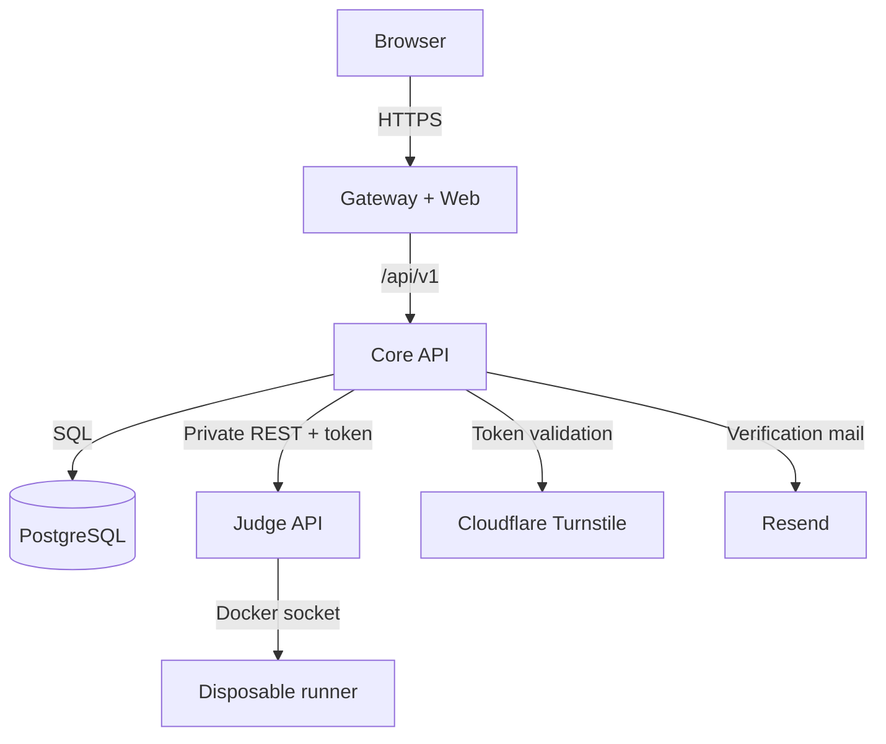

# AlgoQuest service architecture

## Runtime boundary



The public boundary ends at the Gateway. Only the Core API owns user and content
data, and only the Judge service owns Docker-socket access. The Web bundle does
not contain database credentials, Turnstile secrets, email credentials, hidden
tests, or the private Judge token.

## Services

### Gateway and Web

- Serves the Vinext/React application and same-origin `/api` proxy.
- Shows the welcome surface until a verified account and save choice are ready.
- Renders the world map, mission terminal, Editorial, Codex, account panel, and
  role-gated Control Deck.
- Lazy-loads the self-hosted Monaco editor after a mission opens.
- Preloads Cloudflare Turnstile and provides visible loading, timeout, expired,
  unsupported-browser, error-code, and manual-retry states.
- Retries transient API responses with bounded exponential backoff.
- Bakes `NEXT_PUBLIC_API_BASE_URL` into the browser bundle at image-build time.

### Core API

- Creates temporary guest identities during registration/save transfer.
- Creates verified email/password accounts and revocable sessions.
- Sends verification and password-reset mail through Resend.
- Validates Turnstile token, action, and hostname server-side.
- Applies persistent per-IP/per-email authentication limits.
- Hashes passwords with salted `scrypt` and stores only hashes of bearer tokens.
- Resolves local/cloud save conflicts and stores the latest draft per quest.
- Serves dynamic quest definitions and the shared map layout.
- Enforces campaign prerequisites before accepting submissions.
- Proxies submission creation/status to the private Judge and persists results.
- Marks progress cleared only after the durable score reaches the quest pass
  score.
- Hosts discussion, solution, moderation, player management, quest authoring,
  map editing, and owner server controls.
- Falls back to the last durable terminal submission when Judge status is
  temporarily unavailable.

### Judge

- Owns a bounded single-node in-memory queue.
- Allows one active/waiting submission per owner and enforces cooldown/capacity.
- Creates one disposable Docker container per submission.
- Compiles GNU C++14 once, optionally reuses a source-keyed binary cache, and
  runs test cases as fresh UID/GID `10001` child processes.
- Returns `AC`, `CE`, `WA`, `TLE`, `RE`, `MLE`, `OLE`, or `JE` without exposing
  hidden expected or received output.
- Never receives database credentials.

#### Hidden-test transport

The job directory mounted into the runner contains only contestant source and,
after compilation, the executable. The trusted manifest is JSON-serialized into
the Docker process stdin. The root supervisor reads it once with a bounded size,
closes fd 0, and retains the tests only in its own memory. Contestant processes
receive only the current test input through their own stdin.

This avoids host/container UID mismatches on a `0600` manifest and removes the
old contestant-visible `manifest.json` target entirely. A Docker regression
attempts to read both the old mount path and the supervisor stdin before the
change can be merged.

### PostgreSQL

The migrations create:

| Table | Purpose |
|---|---|
| `users` | Guest and authenticated identities, verification and role state |
| `sessions` | Hashed bearer tokens and expiry |
| `quest_progress` | Started/cleared state and best score |
| `submissions` | Owned Judge jobs, verdicts, metrics, and exact source snapshots |
| `account_tokens` | Hashed expiring verification and reset tokens |
| `auth_rate_limits` | Persistent abuse counters keyed by hashed IP/email data |
| `quest_drafts` | Latest cloud source draft per player and quest |
| `quest_catalog` | Custom/overridden public and trusted Judge definitions |
| `server_settings` | Registration, Judge, maintenance, and cooldown controls |
| `submission_cooldowns` | Durable per-player submission reservations |
| `quest_map_layout` | Shared administrator-authored map coordinates |
| `editorial_posts` | Discussions, solutions, moderation state, and author data |

PostgreSQL is not exposed as an application HTTP service. The Core API is its
only application client.

## HTTP boundaries

The complete contract is documented in [API.md](API.md). The major boundaries
are:

```text
Browser
  GET  /api/v1/auth/config
  GET  /api/v1/quests
  POST /api/v1/auth/*
  GET/PUT/POST /api/v1/me/*
  GET/POST /api/v1/editorial/quests/:id
  POST/GET /api/v1/judge/submissions[/:id]
  /api/v1/admin/*      (admin or owner)
  /api/v1/owner/*      (owner only)

Core API -> Judge
  Authorization: Bearer JUDGE_API_TOKEN
  POST /v1/submissions
  GET  /v1/submissions/:id
```

Temporary Judge or Gateway failures use retryable `503` responses. The browser
polls the same job with bounded backoff and does not create a replacement job.

## Deployment shapes

### Windows single-machine test

```text
Browser -> localhost:8080 -> gateway -> api -> judge -> disposable runner
                                      \-> postgres
```

The API, Judge, and database ports bind to loopback by default for diagnostics.
Normal browser traffic enters only through the Gateway.

### Raspberry Pi single-machine production

The same images run on ARM64. Port 80 is the origin for Nginx, cpolar, or a
Cloudflare Tunnel. Persistent PostgreSQL, Judge work, and compile cache data use
named Docker volumes suitable for NVMe-backed Docker storage.

### Split machines

```text
Web host:
  API_UPSTREAM=https://api.internal.example

API host:
  DATABASE_URL=postgres://...@database.internal:5432/algoquest
  JUDGE_API_URL=https://judge.internal.example

Judge host:
  JUDGE_BIND_ADDRESS=0.0.0.0
```

`JUDGE_API_TOKEN` must match on API and Judge. If PostgreSQL crosses machines,
use TLS and a dedicated database user. Prefer a LAN or VPN/Tailnet and firewall
API, Judge, and database ports to exact peer addresses.

## CI and release gate

`.github/workflows/ci.yml` exposes the stable check `required-ci` for pull
requests, merge groups, and pushes to `main`. It runs Web lint/build/tests, Core
API tests, Judge unit tests, Compose validation, runner image build, all seven
public verdict classes, and hidden-manifest isolation. Repository rules should
require this check before merging into `main`; see [CI.md](CI.md).

## Scaling path

The current Judge queue is deliberately local and simple. Jobs are not durable
across Judge restarts and multiple Judge hosts cannot share work. The next scale
milestone is a Redis-backed durable queue with leases, heartbeats, retries, and
multiple Executor workers. The private Judge API boundary allows that change
without replacing the Web submission contract or PostgreSQL history model.
