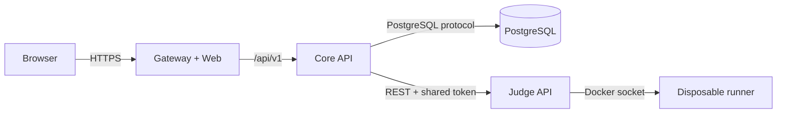

# AlgoQuest service architecture

## Runtime boundary



The public boundary ends at the Gateway. Only the Core API owns user data, and
only the Judge owns access to the Docker socket.

## Services

### Gateway and Web

- Serves the Vinext/React application.
- Proxies `/api/*` to the Core API so a single-machine deployment is
  same-origin.
- Does not contain database credentials or the Judge token.
- Bakes `NEXT_PUBLIC_API_BASE_URL` into the browser bundle at image-build time.

### Core API

- Creates opaque 90-day anonymous sessions.
- Stores only SHA-256 hashes of session tokens.
- Loads and saves quest progress.
- Proxies submission creation and polling to the Judge.
- Records Judge results and marks a quest cleared after `AC`.
- Retries transient status-link failures without creating a second submission.
- Falls back to the last durable terminal result if the Judge restarts.
- Enforces campaign prerequisites before forwarding a submission.
- Applies the private `JUDGE_API_TOKEN` to every Judge request.

### Judge

- Owns the bounded in-memory queue.
- Allows one in-flight submission per player and applies a cooldown.
- Creates one Docker container per submission.
- Compiles once, runs cases sequentially with early stop, and returns
  `CE/WA/RE/TLE/MLE/OLE/AC`.
- Never receives database credentials.

### PostgreSQL

The initial migration creates:

| Table | Purpose |
|---|---|
| `users` | Anonymous or future authenticated player identity |
| `sessions` | Hashed bearer tokens and expiry |
| `quest_progress` | Clear state and best score |
| `submissions` | User-owned Judge job and verdict history |

PostgreSQL is not an HTTP service. The phrase “database service” means an
independently deployable database with the Core API as its only application
client.

## HTTP contract

| Method and path | Auth | Purpose |
|---|---|---|
| `GET /health` | None | API, database, and Judge readiness |
| `POST /v1/sessions` | None | Create a player and return an opaque token |
| `GET /v1/me/progress` | Player bearer token | Load saved progress |
| `PUT /v1/me/progress/:questId` | Player bearer token | Sync progress backed by an accepted submission |
| `POST /v1/judge/submissions` | Player bearer token | Queue a Judge job |
| `GET /v1/judge/submissions/:id` | Player bearer token | Poll an owned job |

The Judge's `/v1/submissions` endpoints require the internal Judge token. The
Core API also verifies ownership before returning a submission status.
Temporary Judge or gateway failures are returned as retryable `503` responses;
the browser keeps polling the same job with bounded exponential backoff.

## Deployment shapes

### Windows single-machine test

All services share the Compose network:

```text
Browser -> localhost:8080 -> gateway -> api -> judge
                                      \-> postgres
```

Only the Gateway is intended for normal browser access. The loopback API,
Judge, and database ports remain available for diagnostics.

### Raspberry Pi single-machine production

The same images run on ARM64. Port 80 is the origin for Nginx, cpolar, or
Cloudflare Tunnel. Persistent data lives in named Docker volumes, which avoids
SD-card-relative bind paths and works with the Judge's sibling runner
containers.

### Split machines

Run a profile on each host and set explicit addresses:

```text
Web host:
  API_UPSTREAM=https://api.internal.example

API host:
  DATABASE_URL=postgres://...@database.internal:5432/algoquest
  JUDGE_API_URL=https://judge.internal.example

Judge host:
  JUDGE_BIND_ADDRESS=0.0.0.0
```

`JUDGE_API_TOKEN` must match on API and Judge. If PostgreSQL crosses machines,
use TLS and a dedicated database user. Prefer a LAN or VPN/Tailnet and firewall
the API, Judge, and database ports to exact peer addresses.

## Scaling path

The current queue is deliberately local and simple. The next scale milestone is
Redis-backed durable jobs plus multiple Judge workers. The API boundary already
allows that replacement without changing the Web client or PostgreSQL schema.
